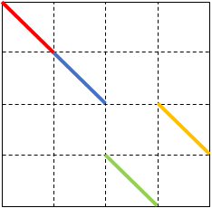
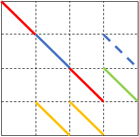
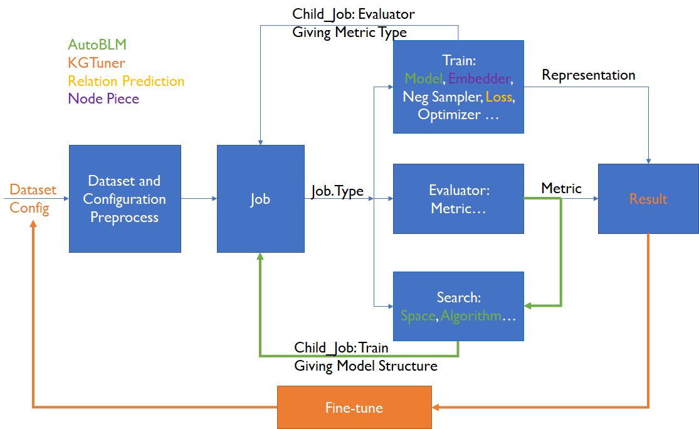

# KGBench

KGBench is a toolbox for knowledge representation learning, which is featured with various automated machine learning methods (e.g. AutoBLM, KGTuner, Ax). The AutoML techniques enable model and hyperparameter search to improve the performance on the representative KG learning task link prediciton.

This repo is developed upon [LibKGE](https://github.com/uma-pi1/kge), which is highly configurable, easy to use, and extensible. Compared to the previous code, we have added [AutoBLM](https://ieeexplore.ieee.org/document/9729658) which adopts bilevel optimization to search bilinear scoring functions, [KGTuner](https://aclanthology.org/2022.acl-long.194.pdf) which has a two-stage hyperparameter search algorithm. In addition, it can add [Relation Prediction](https://openreview.net/pdf?id=Qa3uS3H7-Le) as an auxiliary training objective and [Node Piece](https://arxiv.org/abs/2106.12144) as a special embedder.

KGBench works on both the commonly used KG datasets [WN18RR](https://github.com/TimDettmers/ConvE/blob/master/WN18RR.tar.gz) and [FB15k-237](https://www.microsoft.com/en-us/download/details.aspx?id=52312), as well as the large-scale datasets in OGB, i.e., [ogbl-biokg](https://ogb.stanford.edu/docs/linkprop/#ogbl-biokg) and [ogbl-wikikg2](https://ogb.stanford.edu/docs/linkprop/#ogbl-wikikg2). The current best performance achieved by this toolbox is listed below. Better results may be obtained with more searching trials.

| Dataset      | #Dim | #Parameters | Model Structure                                              | Test MRR       | Valid MRR      | Configuration                                          | Hardware         | Mem     |
| ------------ | ---- | ----------- | ------------------------------------------------------------ | -------------- | -------------- | ------------------------------------------------------ | ---------------- | ------- |
| ogbl-biokg   | 2048 | 192,047,104 |  | 0.8536 ±0.0003 | 0.8548 ±0.0002 | [biokg_best.yaml](example/biokg/biokg_best.yaml)       | Tesla A100 (80G) | 7687MB  |
| ogbl-wikikg2 | 256  | 640,154,624 |  | 0.6404         | 0.6735         | [wikikg2_best.yaml](example/wikikg2/wikikg2_best.yaml) | Tesla A100 (80G) | 41307MB |


| Dataset   | MRR    | Hits@1 | Hits@10 | Model Structure | Configuration                                                |
| --------- | ------ | ------ | ------- | --------------- | ------------------------------------------------------------ |
| FB15k-237 | 0.3668 | 0.2764 | 0.5493  | ComplEX         | [FB15k-237_best.yaml](example/FB15k-237/FB15k-237_best.yaml) |
| WN18RR    | 0.4885 | 0.4489 | 0.5592  | ComplEX         | [WN18RR_best.yaml](example/WN18RR/WN18RR_best.yaml)          |


Exampler configurations are provided in the [folder](example). The following is the instruction AutoBLM, KGTuner, Relation Prediction and Node Piece. See the LibKGE's [README](LibKGE_README.md) for more details of how to use this toolbox. 




## Quick Start 

Here, we provide quick start on how to reproduce the results on the datasets in OGB. You can refer to the [LibKGE_README](LibKGE_README.md) to know about how to use other parts. 

```bash
# retrieve and install project in development mode
git clone https://github.com/AutoML-Research/KGBench
cd KGBench
pip install -e .

# directly run kgbench start
kgbench start examples/biokg/autoblm_biokg_best.yaml

# evaluate on test data after training, using kgbench test + the folder where your training results saved, for example, 
kgbench test local/experiments/20220523-145552-biokg00
```

If you start training on biokg or wikikg2 for the first time, it will take a few minutes for their preprocessing. There are more examples in the folder [biokg](example/biokg) and [wikikg2](example/wikikg2), among which most are some best configs we got and others are the search files. You can use these examples to get into our pipeline quickly. 

Due to the OGB link prediction datasets have their unique evaluate way, we only provide two models, i.e. AutoBLM and ComplEX, to do evaluation. You can overwrite the two functions, i.e. `score_emb_sp_given_negs` and `score_emb_po_given_negs`, to adapt other models.


## AutoBLM: Scoring Function Search

Original [paper](https://ieeexplore.ieee.org/document/9729658) and [code](https://github.com/AutoML-Research/AutoSF).

You can conduct AutoBLM bilevel search by setting `search.type` as `blm` and setting model as `autoblm`. For example, you have a [blm_search_easy.yaml](example/FB15k-237/blm_search_easy.yaml) config file:

```yaml
job.type: search
search.type: blm
dataset.name: fb15k-237

model: autoblm

blm_search:
  num_trials: 300
  K: 4
```
Then you can start blm search on fb15k-237 easily with other hyperparameters set as default: 

```bash
kgbench start example/FB15k-237/blm_search_easy.yaml
```
We search blm on ogbl-biokg and ogbl-wikikg2 using [biokg_blm_search.yaml](example/biokg/biokg_blm_search.yaml) and [wikikg2_blm_search.yaml](example/wikikg2/wikikg2_blm_search.yaml).

See `blm_search` in [config-default.yaml](kgbench/config-default.yaml) for more hyperparameters used in search.

For a given model structure searched by AutoBLM,  you can set `model` as `autoblm` and `autoblm.A` as the given structure for your further study. See [autoblm.yaml](kgbench/model/autoblm.yaml) for more hyperparameters used in model autoblm.


## KGTuner: Hyperparameter Search

Original [paper](https://aclanthology.org/2022.acl-long.194.pdf) and [code](https://github.com/AutoML-Research/KGTuner).

KGTuner has two stages, searching on the subgraph for the first stage and on the original graph for the second stage. In the first stage, use subgraph sampling job to do downsampling. For example, 

```yaml
job.type: search
dataset.name: wnrr
search.type: subgraph_sample
model: complex
subgraph_sample.sampled_ratio: 0.2
```

The configuration file should be saved in the folder *kgtuner*  and use kgtuner.py under the main directory to start KGTuner search. For example, you have such a config file in kgtuner which titled as [example_for_kgtuner.yaml](kgtuner/example_for_kgtuner.yaml): 

```yaml
stage1:
  job.type: search
  dataset.name: sampled_wnrr_0.2
  model: complex
  
  search.type: ax
  ax_search:
    topK: 30
    record_topK: true
    num_trials: 200
    num_sobol_trials: 70
    parameters:
      - name: train.batch_size
        type: choice
        values: [128, 256, 512]
        
stage2:
  job.type: search
  dataset.name: wnrr
  model: complex
  
  search.type: kgtuner2

  kgtuner2:
    topK: 30
    num_trials: 30
```

Then you can run python commond in the terminal to start search, for example,

```bash
python kgtuner.py --config example_for_kgtuner.yaml --device cuda:1
```


## Node Piece and Relation Prediction

We have also implemented [Node Piece](https://arxiv.org/abs/2106.12144) and [Relation Prediction](https://openreview.net/pdf?id=Qa3uS3H7-Le) in the toolbox. 

You can set entity embedder as NodePieceEmbedder to use the trick Node Piece. For example, 

```yaml
import:
- nodepiece_embedder

complex:
  entity_embedder:
    type: nodepiece_embedder
  relation_embedder:
    type: lookup_embedder
    
nodepiece_embedder: 
  dim: 128
  regularize_weight: 0.8e-7
  encoder_dropout: 0.1
  sample_rels: 0
```

See NodePieceEmbedder for more hyperparameters you can use.

LibKGE has an option `wgihts.p` by which you can set the weight of relation prediction loss when you use negative sampling. Compared to the previous loss, this adds p multiplies the loss of relation negative sampling to the total loss, where `weights.p` often be set greater than 0. For example, 

```yaml
negative_sampling:
  weights.p: 0.5
```

In addition, we offered a hyperparameter in 1vsAll so that you can use relation prediction when using 1vsAll. For example, 

```yaml
1vsAll:
  class_name: TrainingJob1vsAll
  relation_prediction: true
  relation_prediction_weight: 0.5
```

Here `relation_prediction_weight` in 1vsAll is equivalent to `weights.p` in negative sampling. 

## Thanks

This toolbox was developed by Lin Li (lli18@mails.tsinghua.edu.cn) as undergraduate graduation project. Due to the limit of time and my competence, there may be some mistakes in the toolbox. Please inform us if you find some bugs or have some advice for our code. Your suggestions are welcomed. 

Thanks for Professor Quanming Yao (qyaoaa@mail.tsinghua.edu.cn) and Doctor Yongqi Zhang (zhangyongqi@4paradigm.com) for their advice and support during the development of this toolbox. Thanks for LibKGE for their open-source code so that we can conduct our work easily. 